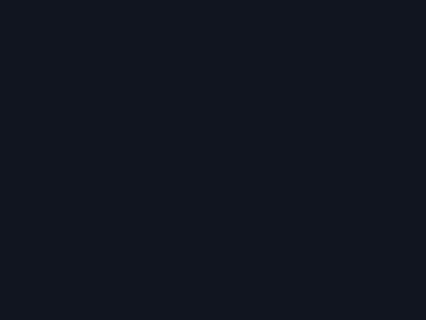

<div align="center">

  

  <p>A free, open-source media app for the TV you already own — Roku edition.</p>

</div>

> **Status:** M0 (foundation). Port of [NuvioMedia/NuvioTV](https://github.com/NuvioMedia/NuvioTV) to Roku BrightScript/SceneGraph. Not yet usable.

## Roadmap

- [x] M0 — foundation: repo, skeleton, lint toolchain, data contracts
- [ ] M1 — auth + profiles + home + detail
- [ ] M2 — streams + player + subtitles + local resume
- [ ] M3 — watch-progress sync
- [ ] M4 — search, collections, addons screen, settings
- [ ] M5 — upstream PR to NuvioMedia

## Platform cuts (honest, documented)

Roku cannot run the Kotlin/web codebases of sibling Nuvio clients. This port
covers the platform-applicable surface only:

- No P2P/torrent streaming (`libtorrent4j`) — Roku forbids P2P; debrid/direct URLs only
- No CloudStream plugins (JVM-only)
- Trakt/Simkl integrations: post-upstream phase
- Dolby Vision: relies on Roku native DV decoding (no DV7 RPU conversion)
- Subtitle formats: Roku player supports SRT/VTT sidecar; ASS falls back to VTT conversion

## Build & lint

See `scripts/lint-megalan.sh` (BrightScript lint runs in Docker on a remote
host; nothing runs locally except `curl`/`git`).

## Repo layout

```
manifest            Roku channel manifest
assets/images/      placeholder icon/splash art (HD/SD)
source/main.brs     entry point
source/config/      backend config (Registry + well-known resolve)
components/         SceneGraph screens (MainScene; M1 adds home/detail/...)
contracts/          curl suite that freezes the JSON contracts the app consumes
scripts/            lint-megalan.sh (bslint in Docker on a remote host)
package.json        toolchain (bslint, roku-deploy)
bslint.json         lint rules
roku_deploy.json    sideload config
LICENSE             GPLv3
```

Note: addon URLs stored in the account's addons table are a mix of base URLs and full manifest URLs — consumers must normalize (contracts/06-subs.sh shows the pattern).

## Contracts

Data contracts run anywhere with `curl` + `jq` (they are light HTTP checks):

```bash
cp contracts/creds/creds.env.example contracts/creds/creds.env  # fill once
bash contracts/run-contracts.sh
```

Coverage: `01` backend discovery (`.well-known/nuvio`, official + self-host) ·
`02` auth (Supabase GoTrue password grant) · `03` account addons (PostgREST
`addons`) · `04` catalog+stream (Stremio protocol via AIOStreams) · `05` series
meta with correct seasons (TMDB episode groups) · `06` subtitles (OpenSubtitles v3).

## Distribution (Roku)

Roku has no download links: a channel is installed via (1) developer sideload
(enable Developer Mode on the device, then `roku-deploy` against the device IP),
(2) an *unlisted* channel link (`my.roku.com/account/add?channel=...`, free
Roku Developer account), or (3) the public Channel Store. Community distribution
target: unlisted channel at M5.

## License

[GNU General Public License v3.0](./LICENSE)
